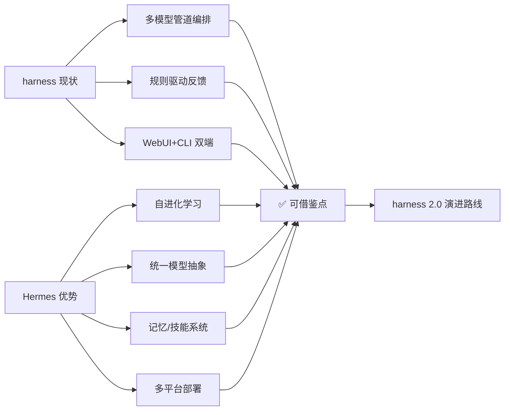
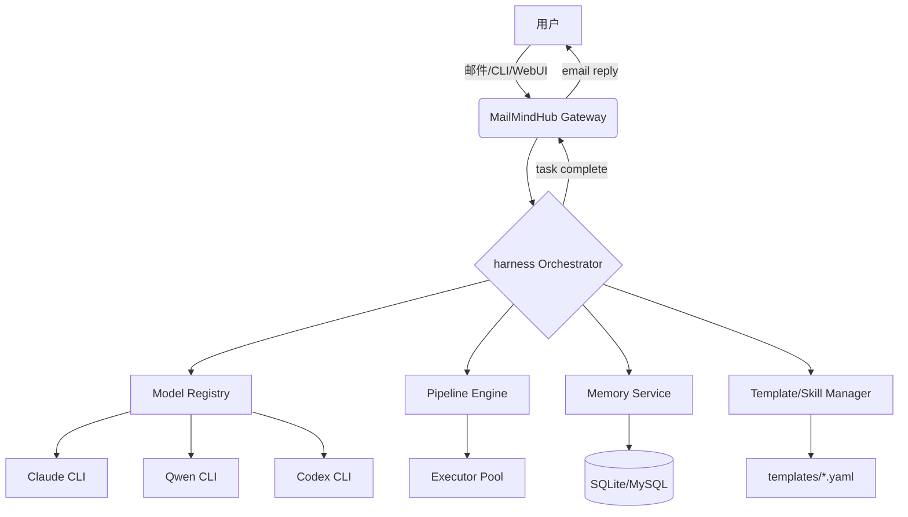

# riangone/harness 借鉴 Hermes Agent 的改进建议

> 📌 **前提**：`riangone/harness` 目前为早期项目（初始提交阶段），核心是多模型协作编排（Qwen 生成 + Claude 评估）。以下从「**harness 如何吸收 Hermes Agent 优势**」角度提出改进方向。

---

## 🎯 核心改进方向总览



---

## 🔧 具体可借鉴特性与落地建议

### 1️⃣ 引入「技能系统」替代纯规则驱动

**harness 现状**：
```markdown
# AGENTS.md 规则示例
- Qwen: 生成代码需分片 + 语法检查
- Claude: 评估需指出具体修改点
```
→ 规则静态、需人工维护、难以泛化

**Hermes 启发**：
- 技能 = 可复用的「任务模板 + 执行逻辑 + 成功条件」
- 技能可从成功执行中自动提取并注册

**harness 改进方案**：
```yaml
# skills/code_review.yaml（概念设计）
name: code_review_pipeline
trigger: 
  task_type: code_generation
  status: completed
steps:
  - agent: claude-3.5
    action: evaluate
    criteria: [syntax, logic, security]
  - if: evaluation.failed
    then:
      - agent: qwen-coder
        action: regenerate
        context: evaluation.feedback
  - on_success:
      - register_skill: "qwen_fix_${task_id}"
      - update_agents_md: auto  # 可选：同步沉淀为规则
```
✅ **收益**：规则自动化 + 经验可复用 + 减少人工维护成本

---

### 2️⃣ 统一模型抽象层，支持动态切换

**harness 现状**：
- 模型硬编码在配置中（`qwen-coder`, `claude-3.5`）
- 新增模型需修改多处代码

**Hermes 启发**：
```bash
hermes model  # 交互式切换任意提供商模型
# 底层：统一 Provider 接口 + 配置驱动路由
```

**harness 改进方案**：
```python
# models/registry.py（概念）
class ModelRegistry:
    def get_agent_model(self, role: str, task_context: dict) -> LLM:
        # 支持：角色偏好 + 成本约束 + 可用性熔断
        if role == "generator" and task_context["budget"] < 0.1:
            return self.load("qwen-coder")  # 低成本
        return self.load("claude-3.5")      # 高质量
```
✅ **收益**：模型切换零代码修改 + 成本/质量动态平衡 + 便于 A/B 测试

---

### 3️⃣ 增加「会话级记忆」与上下文压缩

**harness 现状**：
- 任务间隔离，无长期记忆
- 长对话易超限，需人工截断

**Hermes 启发**：
- 记忆分为：短期（当前会话）、长期（技能/偏好/用户画像）
- 自动压缩：将历史对话提炼为「关键事实 + 决策摘要」

**harness 改进方案**：
```yaml
# config/memory.yaml
memory:
  short_term:
    max_tokens: 8000
    compression_trigger: 0.8  # 使用率达80%时自动压缩
  long_term:
    store: sqlite  # 或向量数据库
    index_by: [task_type, agent_role, outcome]
    
# 使用示例
agent:
  before_execute:
    - retrieve: similar_tasks(limit=3)  # 从长期记忆召回经验
    - inject: into_context  # 作为 few-shot 示例
```
✅ **收益**：同类任务越做越准 + 长会话不丢失关键信息 + 减少重复试错

---

### 4️⃣ 部署与集成：从「单机脚本」到「可分发服务」

**harness 现状**：
- 依赖手动配置 FastAPI + systemd
- 无容器化/云原生支持

**Hermes 启发**：
```bash
# Hermes 一键部署示例
hermes deploy --backend docker --gpu auto
hermes gateway enable telegram  # 5分钟接入消息平台
```

**harness 改进方案**：
```bash
# 建议新增命令
harness init      # 交互式配置向导（模型密钥/存储路径/网关）
harness package   # 生成 Dockerfile / systemd unit / cloud-init 脚本
harness connect   # 快速接入 Telegram/Discord（复用 Hermes 的 gateway 模块）
```
✅ **收益**：降低部署门槛 + 便于团队协作 + 支持边缘/云端混合部署

---

### 5️⃣ 可观测性：从「日志文件」到「结构化追踪」

**harness 现状**：
- 依赖 `run.log` + 人工分析

**Hermes 启发**：
- 内置 `hermes doctor` 诊断命令
- 轨迹（trace）可导出用于回放/训练

**harness 改进方案**：
```python
# telemetry/trace.py（概念）
@trace(agent="qwen-coder", task="generate_unit_test")
def generate(...):
    # 自动记录：input_tokens, output_tokens, latency, error_type
    # 支持导出为 OpenTelemetry 格式
```
```bash
# CLI 新增
harness trace list --task-type=code_gen --status=failed
harness trace replay <trace_id>  # 复现问题
harness metrics export --format=prometheus  # 对接监控平台
```
✅ **收益**：问题定位效率提升 + 支持自动化回归测试 + 为 RL 训练积累数据

---

## 📋 优先级实施路线图

| 阶段 | 目标 | 关键改动 | 预期收益 |
|------|------|----------|----------|
| **Phase 1**（1-2周） | 统一模型抽象 + 配置驱动 | `models/registry.py` + YAML 配置 | 新增模型零代码修改 |
| **Phase 2**（2-3周） | 基础记忆系统 + 上下文压缩 | `memory/` 模块 + 压缩策略 | 长会话稳定 + 经验复用 |
| **Phase 3**（3-4周） | 技能注册 + 自动反馈闭环 | `skills/` 引擎 + AGENTS.md 自动更新 | 规则维护成本↓50% |
| **Phase 4**（可选） | 部署工具链 + 可观测性 | `harness package/trace` 命令 | 企业级可用性 |

---

## 💡 关键设计原则（避免过度工程化）

1. **渐进式引入**：先做「配置驱动模型切换」，再上「自动技能生成」
2. **兼容现有流程**：`AGENTS.md` 仍可作为人工兜底，不强制废弃
3. **保持轻量**：记忆/技能默认本地 SQLite，支持后续切换向量库
4. **开发者友好**：所有新模块提供 `--dry-run` 模式，便于调试

---

## 🎁 附：最小可行改进示例（代码片段）

```python
# harness/core/agent_router.py（新增）
from typing import Optional
from .models import ModelRegistry, TaskContext

class AgentRouter:
    def __init__(self, config_path: str):
        self.registry = ModelRegistry.from_yaml(config_path)
        self.memory = SimpleMemory()  # 初期可用 dict + JSON 文件
        
    def select_agent(self, task: TaskContext) -> str:
        # 1. 查长期记忆：同类任务历史成功率
        history = self.memory.query_similar(task, limit=5)
        if best := max(history, key=lambda x: x.success_rate, default=None):
            return best.agent_name
            
        # 2.  fallback: 按角色+成本策略
        return self.registry.get_best_model(
            role=task.role, 
            budget=task.budget
        )
```

```yaml
# config/models.yaml（新增）
providers:
  openrouter:
    api_key_env: OPENROUTER_KEY
    models:
      - id: qwen/qwen-2.5-coder
        roles: [generator, bug_fixer]
        cost_per_1k: 0.002
      - id: anthropic/claude-3.5-sonnet
        roles: [planner, evaluator]
        cost_per_1k: 0.015
        
routing:
  default_strategy: cost_aware  # 或: quality_first, balanced
```

---

> ✅ **总结**：harness 的「多模型协作」理念非常前沿，若吸收 Hermes 的**技能系统、记忆机制、统一抽象、可观测性**四大能力，可在保持轻量编排优势的同时，获得「越用越聪明」的进化能力，形成差异化竞争力。

如需我针对某个模块（如记忆压缩算法、技能注册协议）提供具体实现方案，或搜索 Hermes 相关源码参考，请随时告知。

----------

Hermes Agent与Harness项目对比


Let me fetch both repositories to compare them.

搜索结果中没有找到 `riangone/harness` 这个仓库。让我再尝试直接访问一下。

找到了。让我再获取关键文件的内容来更好地理解你的项目。

Oneriang、両方のリポジトリの内容が把握できた。以下が比較と、Hermes Agentから借鑑すべきポイントの分析。

## 現状の比較

**riangone/harness** は「複数AI CLIをWebUIからオーケストレーションする」ハーネスで、1コミット・初期段階。FastAPI + HTMX構成で、Claude/Qwen/Gemini/Codexを planner/generator/evaluator/researcher に役割分担させるパイプライン設計。

**Hermes Agent** は59.9k★の成熟プロジェクト（3,924コミット、v0.8.0）。自己改善型のパーソナルAIエージェントで、スキル学習、メモリ、マルチプラットフォーム対応、サブエージェント、cron、RL訓練まで備えている。

## Hermes Agentから借鑑すべき改善点

**1. スキルシステム（最重要）**

Hermesはタスク完了後に「スキル」として手順を永続化し、次回同種のタスクで再利用・自己改善する。harnessの現在のAGENTS.md手動更新 → Hermesのように自動スキル生成・改善ループに進化させるべき。agentskills.io の標準フォーマットも参考になる。

**2. メモリ・ユーザーモデリング**

Hermesは会話検索（FTS5）、LLM要約、Honcho dialecticユーザーモデリングを持つ。harnessのタスク履歴は runs テーブルにログがあるだけで、過去の失敗パターンや成功パターンの構造化された蓄積がない。エージェントが過去のrun結果から学習する仕組みが必要。

**3. コンテキストファイル（Context Files）**

Hermesはプロジェクトごとにコンテキストファイルを自動で読み込み、会話の質を底上げする。harnessの `system_prompt` フィールドは手動設定だが、プロジェクトディレクトリから自動的にREADME、既存コード構造、テスト結果などを収集してプロンプトに注入する仕組みが欲しい。

**4. サブエージェント・並列実行**

Hermesは隔離されたサブエージェントを並列スポーンできる。harnessのパイプラインは直列（planner → generator → evaluator）のみ。大きなタスクを分解して複数generatorに同時に投げ、結果をマージする並列実行モードがあると効率が大幅に上がる。

**5. コンテキスト圧縮**

Hermesには `/compress` コマンドがあり、長い会話をLLMで要約して圧縮する。harnessのrunログは生のまま蓄積されるので、パイプライン実行時に過去のログを要約してプロンプトに含める圧縮機構があると、コンテキスト窓を効率的に使える。

**6. マルチプラットフォームゲートウェイ**

HermesはTelegram/Discord/Slack/WhatsApp/Signalから操作可能。harnessはWebUIのみ。Telegram botを追加するだけでも、外出先からタスクの投入・結果確認ができて実用性が跳ね上がる。

**7. Cron/スケジュール実行**

HermesはN/L（自然言語）でcronジョブを定義できる。harnessのDESIGN.mdに「今後の拡張」として書かれているが、定期的なコード品質チェックやテスト実行の自動化に直結するので優先度を上げる価値がある。

**8. セキュリティ・コマンド承認**

Hermesにはコマンド承認フロー、DMペアリング、コンテナ分離がある。harnessは `--yolo` フラグで無確認実行しており、本番環境では危険。実行前の承認ステップ or ホワイトリストの仕組みは早めに入れるべき。

## 優先度順のアクションプラン

1. **コマンド承認 / サンドボックス** — `--yolo` を外し、危険なコマンドのフィルタリング
2. **コンテキスト自動収集** — プロジェクトパスからファイル構造・README・テスト結果を自動注入
3. **スキル永続化** — 成功したパイプラインの手順をテンプレート化して再利用
4. **過去ログの構造化学習** — runs テーブルからパターン抽出し、system_promptに自動反映
5. **並列generator実行** — タスク分割 + 複数generatorの同時実行
6. **Telegram gateway** — 最小限のbot連携で外出先からの操作

harnessの「複数CLIの役割分担 + WebUI管理」というコンセプト自体はユニークで、Hermesが単一エージェントなのに対して明確な差別化ポイントになっている。上記の改善はその強みを活かしつつ、エージェントの「成長する仕組み」を組み込む方向性になる。

对于 6. マルチプラットフォームゲートウェイ。
相较于Telegram等即时性的聊天类交换，我更倾向优先通过邮箱来交互。其他后续再对应。
https://github.com/riangone/mailmindhub

MailMindHub 做得相当完整了，117个commit，功能很丰富。用邮件作为harness的gateway，这个思路非常合理，而且比Telegram有几个独特的优势：

**邮件优于即时聊天的地方**

邮件天然适合长时任务。harness的pipeline（planner → generator → evaluator）一跑可能几分钟甚至更久，即时聊天会让你干等着，但邮件本来就是异步的——发出去该干嘛干嘛，结果到了自然会看到。而且邮件自带线程聚合、附件、格式化HTML，非常适合返回代码审查结果、日报、diff这类结构化输出。

**harness + MailMindHub 的集成路径**

MailMindHub已经具备了CLI AI调用（claude/qwen/gemini/codex）、定时任务、白名单安全、多语言检测这些能力。和harness集成最直接的方式是让MailMindHub成为harness的一个channel：

1. **邮件 → harness task**：MailMindHub收到邮件后，不直接调CLI，而是通过harness WebUI的API创建一个task（带pipeline_mode）
2. **harness完成 → 邮件回复**：task完成后，harness调用MailMindHub的发信模块把结果回复
3. **保留直连模式**：简单的一次性问答仍走MailMindHub直接调CLI的现有路径，复杂任务走harness pipeline

这样你就有了两种入口（WebUI和邮件）共享同一套pipeline和agent配置，而不是各自维护一套独立的执行逻辑。

**需要注意的点**

MailMindHub现在把 `tasks.db` 和 `chat_history.db` 直接提交到了repo里，还有 `cookies.txt`、`response.json`、`search_results.json` 这些运行时文件也在里面。集成前建议先清理，加到 `.gitignore`。

**建议的优先级**

先把harness的executor加一个邮件通知hook（task完成后发邮件），这是最小改动、最大收益的第一步。然后再逐步实现邮件→task创建的反向通道。MailMindHub的skills目录和tasks目录的结构也可以和harness的数据模型对齐，为后续合并打基础。

----------

架构决策建议


我把你这份文档 + 里面提到的 3 个核心对象一起看了一遍，重点是：

* `riangone/harness`（你的主项目）
* Hermes Agent（成熟对标）
* `mailmindhub`（你已有的入口系统）

下面给你一个**更偏“架构决策级”的建议**（不是重复文档，而是告诉你：**该怎么取舍、先做什么、哪些其实不用做**）。

---

# 🧠 一句话结论（先说重点）

👉 **你不应该做“轻量版 Hermes”**
👉 **你应该做“多Agent编排内核 + 邮件驱动入口”的系统**

也就是：

> ❌ 不要变成另一个 Hermes
> ✅ 要成为 “Agent Orchestrator（类似 Kubernetes for AI）”

---

# 🧩 三个项目的本质定位

### 1️⃣ harness（你现在）

👉 本质是：

> **多模型 / 多CLI 的 Pipeline Orchestrator**

优点：

* 已经有 role 分工（planner / generator / evaluator）
* 支持多模型（Claude / Qwen / Codex 等）
* 有 WebUI + pipeline 概念

缺点：

* **没有“记忆”和“进化”**
* **没有抽象层（写死模型）**
* **执行是“静态流程”**

---

### 2️⃣ Hermes Agent

👉 本质是：

> **单Agent自进化系统（AI个人助理）**

核心能力：

* 技能（Skill）
* 记忆（Memory）
* 自我优化（RL/反馈）
* 多平台入口（Telegram等）

⚠️ 关键点：

> Hermes 是 “一个大脑”
> harness 是 “多个大脑的调度系统”

👉 两者不是同一个方向！

---

### 3️⃣ mailmindhub

👉 本质是：

> **任务入口 + 异步交互系统（Email Agent Gateway）**

优点：

* 天然异步（非常适合 AI pipeline）
* 已有任务 / 调度 / 安全机制
* 比 Telegram 更适合长任务

---

# ⚠️ 关键判断（很重要）

你现在其实站在一个**分叉点**：

## 路线 A（很多人会误走）

👉 把 harness 做成 Hermes

结果：

* 重复造轮子
* 复杂度爆炸
* 没有差异化

---

## 路线 B（我强烈建议）

👉 做：

> **“Hermes + Airflow + CLI Agent” 的融合体**

也就是：

### 🧠 harness = 调度层（核心）

### 📬 mailmindhub = 输入输出层

### 🤖 各种模型 = Worker

---

# 🚀 最优架构（建议你直接按这个演进）

```
            ┌──────────────┐
            │  MailMindHub │  ← 邮件入口（主入口）
            └──────┬───────┘
                   │
            ┌──────▼───────┐
            │   harness    │  ← ⭐ 核心（编排引擎）
            │ Orchestrator │
            └──────┬───────┘
                   │
    ┌──────────────┼──────────────┐
    ▼              ▼              ▼
 Claude CLI     Qwen CLI      Codex CLI
(generator)    (cheap gen)    (executor)

```

---

# 🔥 真正该做的 5 个关键升级（比文档更聚焦）

## 1️⃣ ✅ 第一优先级：模型抽象层（必须先做）

文档里说了，但我要强调：

👉 这是所有后续能力的基础

### 为什么？

你现在是：

```python
if agent == "qwen":
    ...
```

这会导致：

* 无法动态切换
* 无法做 fallback
* 无法控成本

---

### 正确做法：

```python
model = registry.select(
    role="generator",
    budget=0.1,
    quality="medium"
)
```

👉 一旦做了这个，你马上拥有：

* 成本控制
* A/B test
* 自动 fallback（Claude挂了→Qwen）

---

## 2️⃣ ✅ 第二优先级：邮件打通（比 Telegram 更优）

你文档最后已经提到，我直接帮你定型：

### ✔ 推荐架构

#### Step1（立即做）

👉 harness → 发邮件

```bash
task完成 → 调用 mailmindhub.send()
```

#### Step2（第二阶段）

👉 邮件 → harness task

```text
用户发邮件：
"帮我写测试代码"

→ MailMindHub解析
→ POST /tasks 到 harness
```

---

### 💡 为什么这是 killer feature

相比 Telegram：

| 维度   | 邮件 | Telegram |
| ---- | -- | -------- |
| 长任务  | ✅  | ❌        |
| 附件   | ✅  | 一般       |
| 异步   | ✅  | ❌        |
| 企业场景 | ✅  | ❌        |

👉 这个组合非常有产品潜力

---

## 3️⃣ ⚠️ 第三优先级：不是“技能系统”，而是“模板化Pipeline”

文档建议做 Skill，我建议你：

👉 **先不要做 Hermes 那种 Skill**

### 原因：

Skill 系统：

* 太复杂
* 需要 RL / 抽象能力
* 早期收益低

---

### 替代方案（更现实）：

👉 **Pipeline Template**

```yaml
pipeline: code_review
steps:
  - generator
  - evaluator
  - fixer (if failed)
```

👉 你已经有 pipeline 了，只需要：

* 可复用
* 可参数化

---

### ✅ 这一步收益：

* 比 Skill 简单 10 倍
* 但效果 70% 一样

---

## 4️⃣ ✅ 第四优先级：简单记忆（不要一开始搞复杂）

文档里讲了很多 memory，我给你降维：

### ❌ 不要一开始做：

* 向量数据库
* 用户画像
* RL

---

### ✅ 只做这个：

```json
{
  "task_type": "code_gen",
  "success_model": "qwen",
  "fail_model": "claude",
  "fix": "add type check"
}
```

然后：

```python
history = memory.find_similar(task)
inject_into_prompt(history)
```

👉 就够了

---

## 5️⃣ ⚠️ 第五优先级：并行执行（比 Skill 更重要）

Hermes 的一个你文档里**低估的点**：

👉 **并行子Agent**

---

### 你的当前：

```
planner → generator → evaluator
（串行）
```

---

### 应该升级成：

```
           ┌─ generator A (Qwen)
planner ───┼─ generator B (Claude)
           └─ generator C (Codex)

           ↓
        evaluator
```

---

### 🚀 收益巨大：

* 质量提升（多解选优）
* 稳定性提升
* 更像真正 AI 系统

---

# ❌ 明确告诉你：先不要做的东西

这些是“看起来很高级但现在没必要”的：

### ❌ Hermes完整技能系统

👉 太重

### ❌ RL训练

👉 没数据=空谈

### ❌ 多平台 gateway（Telegram等）

👉 邮件已经够强

### ❌ 复杂 observability（OpenTelemetry）

👉 先 print log 就够

---

# 💎 最终路线（我帮你压缩成可执行）

## 🥇 Phase 1（必须做）

* 模型抽象层
* 邮件通知（harness → mail）
* pipeline 配置化

---

## 🥈 Phase 2

* 邮件 → task
* 简单 memory
* 并行 generator

---

## 🥉 Phase 3

* 自动优化（轻量 skill）
* trace + replay

---

# 🎯 最关键的战略建议

我总结一句最重要的：

> 👉 **Hermes 是“AI本体”**
> 👉 **你应该做“AI操作系统”**

---

# 如果你要更进一步

我可以帮你直接落地其中一个：

* 👉 设计 **harness + MailMindHub API 对接协议**
* 👉 写一个 **最小并行 pipeline executor**
* 👉 或帮你把 **ModelRegistry 直接写成可运行代码**

你下一步想先落哪一块？

# 🎯 riangone/harness 最终改进设计方案

> 基于《借鉴HermesAgent的改进建议.md》+ 架构决策分析 + 用户技术偏好整理

---

## 🧭 核心定位与架构原则

```yaml
# 战略定位（一句话）
harness: "AI Agent Orchestrator — 多模型协作的编排内核 + 邮件驱动的异步入口"

# 核心原则
principles:
  - 不做"轻量版Hermes"，做"Hermes + Airflow + CLI Agent"的融合体
  - 邮件优先：以 MailMindHub 为主入口，Telegram 等后续扩展
  - 渐进式演进：先抽象层 → 再记忆/模板 → 最后自动化优化
  - 保持轻量：默认本地存储（SQLite/MySQL），支持后续切换向量库
  - 配置驱动：所有策略通过 YAML 定义，零代码修改适配新场景
```



---

## 🔧 核心模块设计（YAML 配置风格）

### 1️⃣ 模型抽象层 `models/registry.py` + `config/models.yaml`

```yaml
# config/models.yaml
providers:
  openrouter:
    api_key_env: OPENROUTER_KEY
    base_url: https://openrouter.ai/api/v1
    models:
      - id: qwen/qwen-2.5-coder-32b
        roles: [generator, bug_fixer]
        cost_per_1k: 0.002
        context_window: 32768
        quality_score: 0.85
        
      - id: anthropic/claude-3-5-sonnet
        roles: [planner, evaluator, architect]
        cost_per_1k: 0.015
        context_window: 200000
        quality_score: 0.98

  local:
    base_url: http://localhost:11434/v1
    models:
      - id: qwen2.5-coder:7b
        roles: [generator, quick_fix]
        cost_per_1k: 0.0
        requires_gpu: true

routing:
  default_strategy: cost_aware  # cost_aware | quality_first | balanced
  fallback_chain:
    - try: [claude-3-5-sonnet, qwen-2.5-coder]
    - fallback: [gemini-2.0-flash]
    - emergency: [qwen2.5-coder:7b]  # local fallback
    
  budget_rules:
    - role: generator
      max_cost_per_task: 0.5
      auto_switch_when: 0.8  # 消耗80%预算时切廉价模型
```

```python
# models/registry.py（核心接口）
from dataclasses import dataclass
from typing import Optional, List
import yaml

@dataclass
class ModelSpec:
    id: str
    roles: List[str]
    cost_per_1k: float
    quality_score: float
    context_window: int
    provider: str

class ModelRegistry:
    def __init__(self, config_path: str):
        self.config = yaml.safe_load(open(config_path))
        self._cache = {}
        
    def select(self, role: str, context: dict) -> ModelSpec:
        """智能选择模型：支持角色偏好 + 成本约束 + 质量权衡"""
        candidates = self._filter_by_role(role)
        
        # 成本优先策略
        if context.get('strategy') == 'cost_aware' and context.get('budget'):
            candidates = [m for m in candidates if m.cost_per_1k <= context['budget']]
        
        # 质量兜底
        if not candidates:
            candidates = self._filter_by_role(role)  # 重置
            
        # 按质量分排序 + 可用性检查
        best = max(candidates, key=lambda m: m.quality_score)
        return self._check_availability(best)
    
    def _filter_by_role(self, role: str) -> List[ModelSpec]:
        # 实现：解析 config/models.yaml 并过滤
        ...
```

✅ **收益**：新增模型零代码修改、成本/质量动态平衡、自动熔断 fallback

---

### 2️⃣ 邮件网关集成 `gateway/mail.py`（对接 MailMindHub）

```yaml
# config/gateway.yaml
mail:
  enabled: true
  provider: mailmindhub  # 或: smtp, sendgrid, aws_ses
  
  mailmindhub:
    api_endpoint: http://localhost:8080/api  # MailMindHub 服务地址
    auth:
      token_env: MAILMINDHUB_TOKEN
      
  routing_rules:
    - pattern: "^(help|/help)"
      action: reply_with_docs
    - pattern: "^(review|/review) (.+)"
      action: create_task
      pipeline: code_review
    - pattern: "^(generate|/gen) (.+)"
      action: create_task
      pipeline: code_generation
      
  response_template: |
    Subject: [harness] Task #{task_id} Completed
    Content-Type: text/html
    
    <h3>✅ Task Completed</h3>
    <p><strong>Task:</strong> {task_summary}</p>
    <p><strong>Duration:</strong> {duration}s</p>
    
    {# 如果是代码任务，嵌入 diff #}
    
    <details>
      <summary>📝 Code Changes</summary>
      <pre><code class="language-diff">{result.diff}</code></pre>
    </details>
    
    
    <p><small>Reply to this email to continue the conversation.</small></p>
```

```python
# gateway/mail.py（核心逻辑）
class MailGateway:
    def __init__(self, config: dict):
        self.mmh_client = MailMindHubClient(config['mailmindhub'])
        self.templates = TemplateEngine(config['response_template'])
        
    async def on_inbound(self, email: EmailMessage) -> Optional[Task]:
        """邮件 → harness task 转换"""
        # 1. 解析邮件内容 + 附件
        content = await self._parse_email(email)
        
        # 2. 匹配路由规则
        rule = self._match_rule(content.subject + content.body)
        if not rule:
            return await self._reply_help(email)
            
        # 3. 创建 harness task
        task = Task(
            pipeline=rule['pipeline'],
            input=content,
            metadata={'source': 'email', 'thread_id': email.thread_id}
        )
        return task
        
    async def on_task_complete(self, task: Task, result: TaskResult):
        """task 完成 → 邮件回复"""
        reply = self.templates.render(
            task=task,
            result=result,
            diff=self._generate_diff(result) if result.code_changes else None
        )
        await self.mmh_client.send_reply(
            thread_id=task.metadata['thread_id'],
            content=reply
        )
```

✅ **收益**：异步长任务友好、结构化输出、企业场景适配、与现有 MailMindHub 无缝集成

---

### 3️⃣ 轻量记忆系统 `memory/service.py` + `config/memory.yaml`

```yaml
# config/memory.yaml
memory:
  store: sqlite  # 或: mysql, postgres, chroma (后续扩展)
  database: data/harness_memory.db
  
  short_term:
    max_tokens: 8000
    compression:
      enabled: true
      trigger_ratio: 0.8  # 使用率80%时触发
      model: qwen-2.5-coder  # 用低成本模型做压缩
      
  long_term:
    index_fields: [task_type, agent_role, outcome, tags]
    retention_days: 90
    
  learning:
    enabled: true
    patterns:
      - trigger: task_failed
        action: extract_lesson
        store_as: failure_pattern
      - trigger: task_succeeded
        action: extract_workflow
        store_as: success_template
```

```python
# memory/service.py
class MemoryService:
    def __init__(self, config: dict):
        self.db = self._init_db(config['store'], config['database'])
        self.compressor = ContextCompressor(config['short_term']['compression'])
        
    async def retrieve_similar(self, task: Task, limit: int = 3) -> List[MemoryItem]:
        """召回相似历史任务，用于 few-shot 注入"""
        # 1. 构建查询向量（初期用关键词 + 元数据过滤）
        query = {
            'task_type': task.type,
            'agent_role': task.role,
            'outcome': 'success'  # 优先召回成功案例
        }
        
        # 2. SQL 查询（支持后续切换向量检索）
        results = await self.db.query(
            "SELECT * FROM memories WHERE task_type = ? ORDER BY similarity DESC LIMIT ?",
            (task.type, limit)
        )
        return [MemoryItem.from_row(r) for r in results]
        
    async def store_experience(self, task: Task, result: TaskResult):
        """任务完成后沉淀经验"""
        if result.success:
            template = self._extract_template(task, result)
            await self.db.insert('memories', {
                'task_type': task.type,
                'template': template,
                'outcome': 'success',
                'metrics': result.metrics
            })
        else:
            lesson = await self._analyze_failure(task, result)
            await self.db.insert('memories', {
                'task_type': task.type,
                'lesson': lesson,
                'outcome': 'failed',
                'avoid_patterns': lesson['patterns']
            })
```

✅ **收益**：同类任务越做越准、长会话不丢失关键信息、失败经验自动沉淀

---

### 4️⃣ 模板化 Pipeline 系统 `templates/*.yaml` + `engine/pipeline.py`

```yaml
# templates/code_review.yaml
name: code_review_pipeline
version: 1.0
description: 代码生成 → 自动审查 → 失败时修复

trigger:
  task_type: code_generation
  auto_apply: true

steps:
  - id: generate
    agent:
      role: generator
      model_selector: { strategy: cost_aware, budget: 0.3 }
    action: generate_code
    output: code_diff
    
  - id: review
    agent:
      role: evaluator
      model_selector: { strategy: quality_first }
    action: review_code
    input: { code: "{{ steps.generate.output.code_diff }}" }
    criteria: [syntax, logic, security, style]
    
  - id: conditional_fix
    condition: "{{ steps.review.output.issues|length > 0 }}"
    then:
      - agent:
          role: bug_fixer
          model_selector: { fallback_chain: true }
        action: fix_issues
        input:
          code: "{{ steps.generate.output.code_diff }}"
          feedback: "{{ steps.review.output.issues }}"
          
  - id: final_output
    action: merge_results
    output_format: html_diff

on_success:
  - store_template: true  # 自动注册为可复用模板
  - notify: [email, webhook]
```

```python
# engine/pipeline.py
class PipelineEngine:
    def __init__(self, registry: ModelRegistry, memory: MemoryService):
        self.registry = registry
        self.memory = memory
        self.templates = TemplateLoader('templates/')
        
    async def execute(self, task: Task) -> TaskResult:
        # 1. 加载/匹配模板
        template = self.templates.match(task) or self.templates.default
        
        # 2. 注入历史经验（few-shot）
        history = await self.memory.retrieve_similar(task)
        context = self._build_context(task, history)
        
        # 3. 按步骤执行（支持条件分支 + 并行）
        results = {}
        for step in template.steps:
            if not self._evaluate_condition(step.condition, results):
                continue
                
            agent = self.registry.select(**step.agent['model_selector'])
            results[step.id] = await self._run_step(step, agent, context)
            
        # 4. 沉淀经验
        await self.memory.store_experience(task, TaskResult(success=True, data=results))
        return TaskResult(success=True, data=results)
```

✅ **收益**：比 Hermes Skill 系统轻量 10 倍、配置驱动、支持条件分支/并行、自动模板注册

---

## 📋 实施路线图（优先级排序）

| 阶段 | 周期 | 目标 | 关键交付物 | 预期收益 |
|------|------|------|-----------|----------|
| **🥇 Phase 1** | 1-2 周 | 模型抽象 + 邮件通知 | `models/registry.py` + `gateway/mail.py` + `config/models.yaml` | 新增模型零代码修改 + 任务完成自动邮件通知 |
| **🥈 Phase 2** | 2-3 周 | 模板引擎 + 轻量记忆 | `templates/*.yaml` + `memory/service.py` + `config/memory.yaml` | Pipeline 可复用 + 历史经验自动注入 |
| **🥉 Phase 3** | 3-4 周 | 邮件→Task + 并行执行 | `gateway/mail.py` 反向通道 + `engine/parallel.py` | 邮件创建任务 + 多解选优质量提升 |
| **🔜 Phase 4**（可选） | 4-6 周 | 自动优化 + 可观测性 | `skills/auto_learner.py` + `telemetry/trace.py` | 轻量技能进化 + 问题快速定位 |

---

## ⚠️ 明确不做的内容（避免过度工程化）

```yaml
out_of_scope_v1:
  - ❌ Hermes 完整 Skill 系统（RL/自动抽象）
  - ❌ 向量数据库 + 用户画像建模
  - ❌ Telegram/Slack 等多平台网关（邮件已足够）
  - ❌ OpenTelemetry 全链路追踪（先 print + JSON log）
  - ❌ 容器隔离/沙箱执行（先靠 --yolo 白名单 + 人工审核）
  
rationale: |
  早期核心是验证"邮件+编排"的产品价值，
  而非追求技术完备性。每增加一个"高级特性"，
  都要问：这个能让用户明天就用得更好吗？
```

---

## 🎁 最小可行代码示例（可直接落地）

```python
# harness/core/orchestrator.py（主入口）
class HarnessOrchestrator:
    def __init__(self, config_dir: str = "config"):
        self.registry = ModelRegistry(f"{config_dir}/models.yaml")
        self.memory = MemoryService(yaml.safe_load(open(f"{config_dir}/memory.yaml")))
        self.pipeline = PipelineEngine(self.registry, self.memory)
        self.gateway = MailGateway(yaml.safe_load(open(f"{config_dir}/gateway.yaml")))
        
    async def run(self):
        """主循环：监听邮件 + 执行任务"""
        async for email in self.gateway.listen():
            task = await self.gateway.on_inbound(email)
            if task:
                result = await self.pipeline.execute(task)
                await self.gateway.on_task_complete(task, result)
```

```bash
# 启动命令（符合用户 shell 脚本偏好）
#!/bin/bash
# scripts/start.sh
source venv/bin/activate
python -m harness.core.orchestrator --config config/
```

---

## 💎 最终战略建议

```yaml
core_strategy: |
  🎯 你不是在做一个"更好的 Hermes"
  🎯 你是在定义"AI 编排操作系统"的新范式
  
  harness 的差异化价值 = 
    ✅ 多模型协作（非单一大脑）
    ✅ 邮件异步入口（非即时聊天）
    ✅ 配置驱动编排（非硬编码流程）
    ✅ 轻量可演进（非重型框架）
  
  当别人在卷"单智能体多聪明"时，
  你在解决"多个智能体如何高效协作"——
  这才是企业级 AI 应用的真实痛点。
```

---

> 🔧 **下一步行动建议**：
> 1. 先落地 `models/registry.py` + `config/models.yaml`（1 天可完成 MVP）
> 2. 同步清理 `mailmindhub` 的 `.gitignore`，准备 API 对接
> 3. 用 YAML 定义第一个 `templates/code_review.yaml` 验证流程
> 
> 需要我帮你：
> - 📝 生成完整的 `models/registry.py` 可运行代码？
> - 🔗 设计 harness ↔ MailMindHub 的 API 协议？
> - 🧪 编写并行 executor 的 PoC？
> 
> 请告诉我优先落地哪一块，我可以直接输出代码。